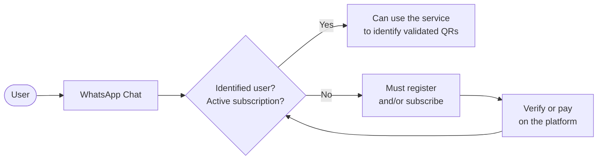

# B2C flow — source of truth

> Date: 2026-08-22 · Status: **authoritative for B2C**. If this document conflicts with a report in `docs/research/`, this document takes precedence.
>
> B2B scope is defined separately and is not derived from here.

This document replaces the role formerly held by the Identity Binding thesis, which was removed from the repository. It lives in `docs/`, rather than `docs/research/`, because it is a product definition, not research.

---

## The Flow



---

## What this flow sets

1. **The channel of use is WhatsApp.** The user sends the QR via chat and receives the response there.

2. **There is an identity and subscription gateway before checking.** The service is not anonymous or open: each query is answered against an identified user with a current subscription.

3. **Registration and payment occur on the platform, not in the chat.** It is a decision with a direct consequence on the risk of the channel: the bot never asks for personal data or charges within WhatsApp, which is precisely what a scam does. The gate resolves outside and the chat only verifies.

4. **Registration is prior.** For the recurring user, the gate is an invisible step: write and get a response. The diversion to registration is the case of first use or expired subscription.

5. **After the discharge or payment is resolved, the gate is re-evaluated.** There is no shortcut that bypasses subscription verification.

---

## Operational Implications

### The Engine

The verification engine lives in `apps/bot`, on the `feat/motor-verificacion` branch, **which has not yet been merged into `main`**. It is channel-agnostic and **does not know about users or subscriptions**. This flow adds an eligibility layer in front of it:

```
incoming message → gateway (identity + subscription) → engine → response
```

The gate decides **if the query is answered **. The engine decides **what is answered**. They should not mix: if the gate contaminates the verdict, an unsubscribed user could receive a response that looks like a judgment on the QR when in fact it is a judgment on their account.

### About the channel

Keeping registration and payment outside the chat addresses half of the risk identified in the main report: WhatsApp is the dominant fraud channel. The other half remains: a bot that asks users to "send me the QR" still resembles the scam that says the same thing. The design mitigations remain in force: the bot never initiates a conversation, never requests data, and has a physical entry point. They are detailed in [QR verification bot design](./research/qr-verification-bot-design.md).

---

## Open Question

The diagram has a single affirmative exit: *"can use the service to identify validated QRs."* That box does not distinguish **what the service answers** after it handles a query.

The engine implemented on `feat/motor-verificacion` returns five states, whose differences distinguish this product from an ordinary QR reader. Until that branch enters `main`, this table describes **the agreed architecture, not what currently runs on `main`**:

| Status | What it says |
|---|---|
| **Verified** | Code is authorized by the declared issuer |
| **Unauthorized** | Only within a closed coverage domain, where absence is information |
| **Out of Coverage** | Not enough to confirm or rule out. **Not a warning** |
| **Anomaly** | Something verifiable in the code itself is wrong, without relying on registration |
| **Illegible** | Could not read image. It doesn't say anything about the code |

While the registry remains empty, **the real answer to almost every query is "out of coverage."** The current diagram does not show this, and that is the difference between what the flow promises and what the system can answer today.

It remains to be defined whether that distinction is incorporated into the flow or considered implementation detail below the green box.
