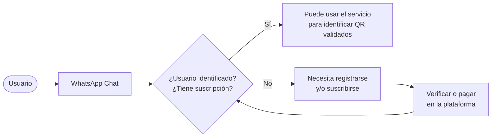

# Flujo B2C — fuente de verdad

> Fecha: 2026-08-22 · Estado: **autoritativo para B2C**. Ante cualquier discrepancia entre este documento y los informes de `docs/research/`, manda éste.
>
> El alcance B2B se define por separado y no se deriva de acá.

Este documento reemplaza el rol que ocupaba la tesis de Identity Binding, eliminada del repo. Se ubica en `docs/` y no en `docs/research/` porque no es investigación: es una definición de producto.

---

## El flujo



---

## Qué fija este flujo

1. **El canal de uso es WhatsApp.** El usuario manda el QR por chat y recibe la respuesta ahí.

2. **Hay una compuerta de identidad y suscripción antes de verificar.** El servicio no es anónimo ni abierto: cada consulta se atiende contra un usuario identificado con suscripción vigente.

3. **El alta y el pago ocurren en la plataforma, no en el chat.** Es una decisión con consecuencia directa sobre el riesgo del canal: el bot nunca pide datos personales ni cobra dentro de WhatsApp, que es justamente lo que hace una estafa. La compuerta se resuelve afuera y el chat sólo verifica.

4. **La registración es previa.** Para el usuario recurrente la compuerta es un paso invisible: escribe y obtiene respuesta. El desvío al alta es el caso de primer uso o de suscripción vencida.

5. **Después de resolver el alta o el pago, se vuelve a evaluar la compuerta.** No hay atajo que saltee la verificación de suscripción.

---

## Consecuencias operativas

### Sobre el motor

El motor de verificación (`apps/bot`) es agnóstico del canal y **no conoce usuarios ni suscripciones**. Este flujo agrega una capa de habilitación por delante:

```
mensaje entrante → compuerta (identidad + suscripción) → motor → respuesta
```

La compuerta decide **si se atiende la consulta**. El motor decide **qué se contesta**. No deben mezclarse: si la compuerta contamina el veredicto, un usuario sin suscripción podría recibir una respuesta que parezca un juicio sobre el QR cuando en realidad es un juicio sobre su cuenta.

### Sobre el canal

Que el alta y el cobro estén fuera del chat resuelve la mitad del riesgo identificado en el informe principal (WhatsApp es el canal dominante del fraude). Queda en pie la otra mitad: un bot que pide "mandame el QR" sigue pareciéndose a la estafa que dice lo mismo. Las mitigaciones de diseño siguen vigentes —el bot nunca inicia conversación, nunca pide datos, la entrada es física— y están detalladas en [`research/bot-verificacion-qr-diseno.md`](./research/bot-verificacion-qr-diseno.md).

---

## Punto abierto

El diagrama tiene una sola salida afirmativa: *"puede usar el servicio para identificar QR validados"*. Esa caja no distingue **qué contesta el servicio** una vez que la consulta se atiende.

El motor ya devuelve cinco estados, y la diferencia entre ellos es lo que separa a este producto de un lector de QR común:

| Estado | Qué afirma |
|---|---|
| **Verificado** | El código está autorizado por el emisor declarado |
| **No autorizado** | Sólo dentro de un dominio de cobertura cerrado, donde la ausencia sí es información |
| **Fuera de cobertura** | No alcanza para confirmar ni descartar. **No es una advertencia** |
| **Anomalía** | Algo verificable en el código mismo está mal, sin depender del registro |
| **Ilegible** | No se pudo leer la imagen. No dice nada sobre el código |

Mientras el registro esté vacío, **la respuesta real a casi toda consulta es "fuera de cobertura"**. El diagrama, tal como está, no refleja eso, y es la diferencia entre lo que el flujo promete y lo que el sistema puede contestar hoy.

Falta definir si esa distinción se incorpora al flujo o se considera detalle de implementación por debajo de la caja verde.
